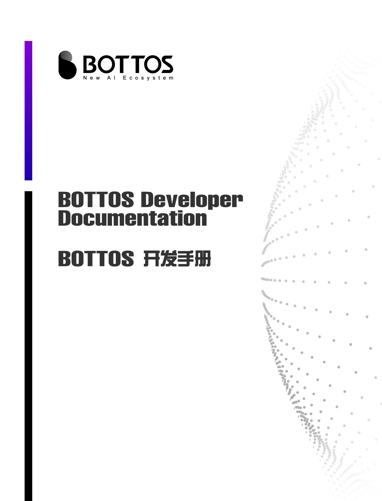
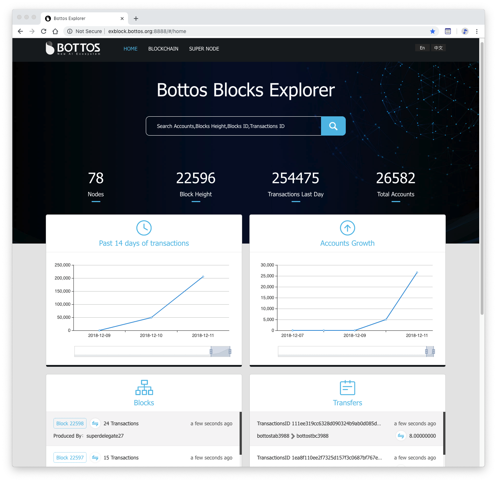
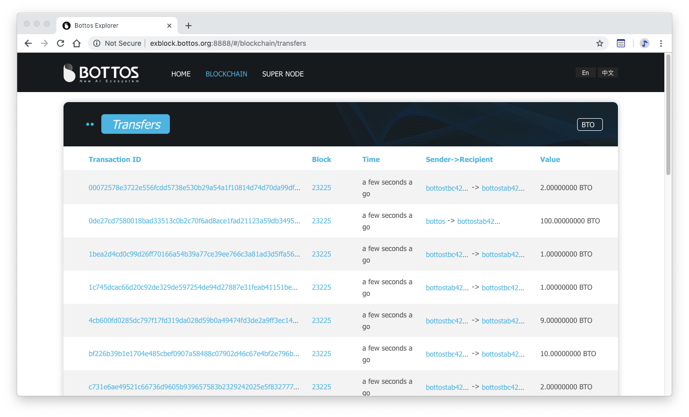
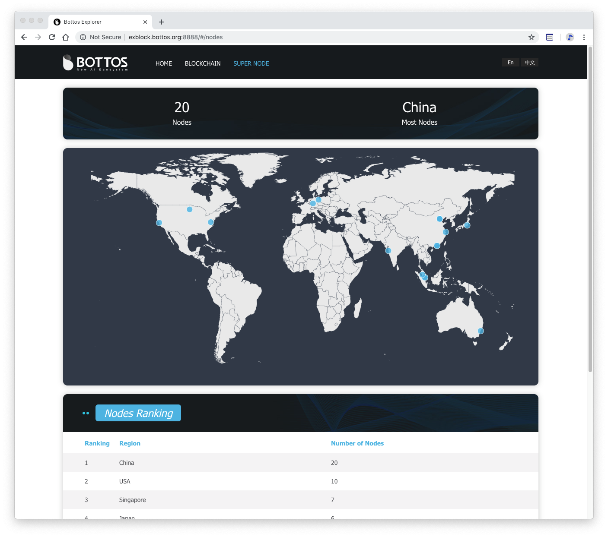

<div style="page-break-after: always;"></div>

<!-- TOC -->

- [1. Bottos简介](#1-bottos简介)
    - [1.1. 项目介绍](#11-项目介绍)
    - [1.2. 系统架构](#12-系统架构)
    - [1.3. 网络结构](#13-网络结构)
- [2. 入门体验](#2-入门体验)
    - [2.1. 使用区块浏览器总览Bottos链](#21-使用区块浏览器总览bottos链)
        - [2.1.1. Bottos链状态总览](#211-bottos链状态总览)
        - [2.1.2. 链上操作汇总](#212-链上操作汇总)
        - [2.1.3. 超级节点分布](#213-超级节点分布)
    - [2.2. 本地运行Bottos链](#22-本地运行bottos链)
    - [2.3. 准备Bottos可执行版本](#23-准备bottos可执行版本)
    - [2.4. 准备运行环境](#24-准备运行环境)
        - [2.4.1. 启动本地单节点环境](#241-启动本地单节点环境)
        - [2.4.2. 加入已存在的测试网络](#242-加入已存在的测试网络)
    - [2.5. 体验基本操作](#25-体验基本操作)
        - [2.5.1. 创建钱包](#251-创建钱包)
        - [2.5.2. 创建account](#252-创建account)
        - [2.5.3. 体验转账](#253-体验转账)
- [3. 操作进阶](#3-操作进阶)
    - [3.1. 质押](#31-质押)
    - [3.2. 赎回](#32-赎回)
    - [3.3. 投票资源](#33-投票资源)
    - [3.4. 空间资源](#34-空间资源)
    - [3.5. 时间资源](#35-时间资源)
- [4. 开发指引](#4-开发指引)
    - [4.1. 环境搭建](#41-环境搭建)
        - [4.1.1. 基础环境准备](#411-基础环境准备)
            - [4.1.1.1. 操作系统](#4111-操作系统)
            - [4.1.1.2. 节点基础版本包安装](#4112-节点基础版本包安装)
        - [4.1.2. 单节点开发环境](#412-单节点开发环境)
        - [4.1.3. 多节点开发环境](#413-多节点开发环境)
    - [4.2. 智能合约](#42-智能合约)
        - [4.2.1. 智能合约简介（也包含合约书写规则和abi介绍）](#421-智能合约简介也包含合约书写规则和abi介绍)
        - [4.2.2. C++智能合约开发示例](#422-c智能合约开发示例)
        - [4.2.3. JavaScript智能合约开发示例](#423-javascript智能合约开发示例)
    - [4.3. BCLI命令](#43-bcli命令)
    - [4.4. DAPP开发](#44-dapp开发)
        - [4.4.1. JavaScript合约开发示例](#441-javascript合约开发示例)
    - [4.5. 开发工具集](#45-开发工具集)
        - [4.5.1. 钱包SDK](#451-钱包sdk)
        - [4.5.2. C++合约开发SDK](#452-c合约开发sdk)
        - [4.5.3. JavaScript合约开发SDK](#453-javascript合约开发sdk)
- [5. 超级节点启动指引](#5-超级节点启动指引)
    - [5.1. 基础准备](#51-基础准备)
    - [5.2. 安全提升](#52-安全提升)
- [6. 资源库](#6-资源库)
    - [6.1. C++合约开发SDK](#61-c合约开发sdk)
    - [6.2. JavaScript合约开发SDK](#62-javascript合约开发sdk)
    - [6.3. 钱包开发SDK](#63-钱包开发sdk)
    - [6.4. 公共REST API](#64-公共rest-api)
    - [6.5. 钱包API](#65-钱包api)

<!-- /TOC -->

# 1. Bottos简介

## 1.1. 项目介绍

[Bottos项目介绍](./resource_cn/项目介绍.md)

## 1.2. 系统架构

[Bottos系统架构](./resource_cn/系统架构.md)

## 1.3. 网络结构

[Bottos网络](./resource_cn/Bottos网络.md)


# 2. 入门体验

本章节将向读者展示如何把 Bottos 链在本地运行起来，并在链上体验 register/transfer 等基本操作。

>  当然，也可以下载手机钱包，体验Bottos链的基本功能。([Android Wallet](https://dapp.botfans.org/wallet/BottosWallet.apk): https://dapp.botfans.org/wallet/BottosWallet.apk)


## 2.1. 使用区块浏览器总览Bottos链

[Bottos区块浏览器](http://exblock.bottos.org:8888/#/home)地址 为 http://explorer.bottos.org

### 2.1.1. Bottos链状态总览



### 2.1.2. 链上操作汇总




### 2.1.3. 超级节点分布




## 2.2. 本地运行Bottos链

## 2.3. 准备Bottos可执行版本

[准备Bottos可执行版本](./resource_cn/准备Bottos版本.md)

## 2.4. 准备运行环境

### 2.4.1. 启动本地单节点环境

使用如下指令启动Bottos单节点

```
./bottos --delegate bottos --enable-wallet
```
> 参数含义:
> `--delegate`: 指定区块生产者的account是bottos
> `--enable-wallet`: 指定链启动时把wallet服务一并启动


如果返回如下信息说明节点启动成功

```
CommitBlock by p2p: lib: 1
InsertBlock: number:1, delegate:bottos, trxn:0, time=1537948299, hash: 566fb29ab982c128bf6c71297bc4e7d558e0f86ae89a7f3955ea46b04689fb5a, prevHash=caf2bae84f70412354211dd5028142eca6901b06b9a65dfbe9df065bcf56e291
CommitBlock by p2p: lib: 2
InsertBlock: number:2, delegate:bottos, trxn:0, time=1537948302, hash: 8abe6aef22249ab58d6c7cd3970f909571c4e818f3757d9de7d86870bfc7465b, prevHash=566fb29ab982c128bf6c71297bc4e7d558e0f86ae89a7f3955ea46b04689fb5a
```
&nbsp;

### 2.4.2. 加入已存在的测试网络


将上述启动的单节点连接到Bottos测试网络。需要做如下配置：


修改`config-testnet.toml`文件

- P2PServAddr:修改成当前节点的外网IP

```
P2PServAddr = "192.168.1.1"   // 修改成当前节点的外网IP
```

然后运行如下命令即可将当前节点连接到测试网络

`注`：如果项目目录下有`datadir`缓存目录，我们首先需要运行如下命令删除缓存

```
rm -rf datadir
```

启动节点，连接到测试网络

```
./bottos --config="./config-testnet.toml" --genesis="./genesis-testnet.toml"
```

等一会儿如果出现大量如下打印信息，说明在自动同步区块.已经成功连接到了测试网络

```
CommitBlock by p2p: lib: 1
InsertBlock: number:1, delegate:bottos, trxn:0, time=1537888767, hash: 03f6c7aa72314be76902b6c2d4b86b7afbb07d2b4b4dec67caf6fc51e125e9ed, prevHash=98128aa21d634eda9cb0152314b06480d4c51b0bf18ea6d39f5189388e1bf4ee
CommitBlock by p2p: lib: 2
InsertBlock: number:2, delegate:bottos, trxn:0, time=1537888770, hash: c87a1c59aaa87f890169a1016931b3a9e539e72e475c0861623ed36fbd00c1b4, prevHash=03f6c7aa72314be76902b6c2d4b86b7afbb07d2b4b4dec67caf6fc51e125e9ed
CommitBlock by p2p: lib: 3
InsertBlock: number:3, delegate:bottos, trxn:0, time=1537888773, hash: 3bcf9ecf116891b226b2c6b31578d5f1ee867a75b667752286eeaf3d237e684b, prevHash=c87a1c59aaa87f890169a1016931b3a9e539e72e475c0861623ed36fbd00c1b4
CommitBlock by p2p: lib: 4
```

## 2.5. 体验基本操作

### 2.5.1. 创建钱包

准备钱包账户、密码和私钥。

这里以创建bottos钱包举例，私钥取config.toml里面的bottos私钥

```
进入项目代码路径
cd ~/bottos-node/bottos/
创建bottos钱包
 ./bcli wallet create --account bottos
```

这样bottos钱包就创建好了，会创建包含私钥和密码的bottos.keystore文件，存放在bot目录下。

```
root@node:~/bottos-node/bottos#bcli wallet create --account bottos

Please input your password for your wallet:

Please input your password again for your wallet:

Please input your private key for your wallet:

{
    "wallet_name": "bottos.keystore"
}

Create wallet done. Now unlock the wallet within 300 seconds.
{
    "unlock": true
}
```

### 2.5.2. 创建account

在项目代码路径下执行如下操作：

```
进入项目代码路径
cd bottos-node/bottos/
生成一对公私钥（保存下来）
./bcli wallet  generatekey
输入密码解锁钱包
./bcli wallet unlock --account bottos
创建账户名为test001、上述保存的公钥、引荐人为bottos 的用户
./bcli account create --account test1234567890  --pubkey 0411c2d1679d2b40e9bb7060eab34edc5e6fa69d4142728fad131d141fa6c61452b747c88dd0bc9584024a58787646a06e7c798211eed24f4e4687732747fbe79c --referrer bottos
```

example：执行成功会返回交易的哈希

```
root@node:~/bottos-node/bottos# ./bcli wallet  generatekey
public_key: 0411c2d1679d2b40e9bb7060eab34edc5e6fa69d4142728fad131d141fa6c61452b747c88dd0bc9584024a58787646a06e7c798211eed24f4e4687732747fbe79c
private_key: 8529d2c8a51df6105a46a5363cc2378f95060c39ac5212e2d5c6ba436de0d7dd
root@node:~/bottos-node/bottos# ./bcli account create --account test1234567890 --pubkey 0411c2d1679d2b40e9bb7060eab34edc5e6fa69d4142728fad131d141fa6c61452b747c88dd0bc9584024a58787646a06e7c798211eed24f4e4687732747fbe79c --referrer bottos
Create account: test1234567890 Succeed
Trx:
{
    "version": 1,
    "cursor_num": 299,
    "cursor_label": 1590795549,
    "lifetime": 1540264573,
    "sender": "bottos",
    "contract": "bottos",
    "method": "newaccount",
    "param": {
        "name": "test1234567890",
        "pubkey": "0411c2d1679d2b40e9bb7060eab34edc5e6fa69d4142728fad131d141fa6c61452b747c88dd0bc9584024a58787646a06e7c798211eed24f4e4687732747fbe79c"
    },
    "param_bin": "dc0002da000774657374303031da008230343131633264313637396432623430653962623730363065616233346564633565366661363964343134323732386661643133316431343166613663363134353262373437633838646430626339353834303234613538373837363436613036653763373938323131656564323466346534363837373332373437666265373963",
    "sig_alg": 1,
    "signature": "7234c464012a560296683bd6f4992f1bc82526824e8b6f400b75502d261f31db4f20d95419d538ce43b82ecaf6297f0b107a911075b9290be8320b820e1941cc"
}
TrxHash: cde9db1ec6ed4622104acc81cac94c9765b9de3e997b1b4f46b1e83ed94163da

Please create wallet for your new account.
```

### 2.5.3. 体验转账

 在项目代码路径下执行如下操作：

```
进入项目代码路径
cd bottos-node/bottos/
输入密码解锁钱包
./bcli wallet unlock --account bottos
转账：bottos向test001转账1000BTO
./bcli transfer --from bottos --to test1234567890 --amount 1000
```

example：执行成功会返回交易的哈希

```
root@node:~/bottos-node/bottos# ./bcli wallet unlock --account bottos

Please input your password for your wallet:

{
    "unlock": true
}
root@node:~/bottos-node/bottos# ./bcli transfer --from bottos --to test1234567890 --amount 1000
Transfer Succeed
    From: bottos
    To: test1234567890
    Amount: 10000000000000000000
Trx:
{
    "version": 1,
    "cursor_num": 158,
    "cursor_label": 413395567,
    "lifetime": 1540265785,
    "sender": "bottos",
    "contract": "bottos",
    "method": "transfer",
    "param": {
        "from": "bottos",
        "to": "test1234567890",
        "value": 100000000000
    },
    "param_bin": "dc0003da0006626f74746f73da000774657374303031c500200000000000000000000000000000000000000000000000008ac7230489e80000",
    "sig_alg": 1,
    "signature": "fd719d1222cca73e19c7b8693d660527e885b29fec6deed57ac15a71e2e5c2824c15171a5ba3f475c81ed5ef747244674e84339daf12ff0d4df72e05c79cd6a7"
}
TrxHash: 83d5042570b666f2eba9e5cdbbab735444c93f4cb41a64e3b132dbba7fda6b43
```


# 3. 操作进阶

## 3.1. 质押

用户需要质押一定数量的BTO，以便有足够的权限对生产节点进行投票，或发生转账或其他合约等交易行为。

对于尚未质押BTO的用户:

用户将无法执行投票操作（投票会失败），以及执行合约交易等行为的次数非常有限（免费额度）：在操作3次的转账或者其他合约后，当天将会失去操作权限（次日将恢复等同次数权限）。

对于已质押BTO的用户：

对用户将开放一定量投票次数和资源的使用权限（视质押数多少而定），如果在1天内操作超过质押权限次数的操作（投票，转账或者其他合约）后，用户还拥有一定操作的权限（免费额度），如果在1天内使用完这些额度，则该天将失去操作权限（次日将恢复一定次数权限）。

质押操作方式：
​    见3.3节


## 3.2. 赎回

质押用户需要赎回质押的BTO，需要先操作解质押操作（3.3节，在手机端采取‘解质押’操作）。
解质押操作完毕后，需要等待3天后才可"赎回"，用户的BTO将可以采取“赎回”操作，赎回操作完成后的BTO会立即返回用户账户中。

## 3.3. 投票

对资源进行质押有两种渠道：

普通用户使用手机端钱包为本账号资源进行质押：

1.登录用户或导入用户；

2.在“资产详情”界面，点击 BTO 资产行，进入质押界面；

3.点击“质押”按钮，在“质押BTO数”，输入质押数量，“质押目标”根据需要，选择“空间”或“时间”；

4.输入密码进行质押操作。


如果是开发者，也可使用BCLI命令行进行质押操作；

\# ./bcli account stake --account bottostest --amount 100 --target vote

\# ./bcli account stake --account bottostest --amount 100 --target space #空间资源，见章节 3.4 和 3.5

\# ./bcli account stake --account bottostest --amount 100 --target time #时间资源，见章节 3.4 和 3.5

也可以用BCLI进行解质押操作（3天后才可“赎回”）：

\# ./bcli account unstake --account bottostest --amount 100 --source vote vote #解质押也可只解质押部分BTO

\# ./bcli account unstake --account bottostest --amount 100 --source space #解质押也可只解质押部分BTO

\# ./bcli account unstake --account bottostest --amount 100 --source time #解质押也可只解质押部分BTO

说明：每个账号每24小时拥有3次 PUSTH transaction的免费额度（单次衡量标准为 转账交易 所消耗的资源量）


## 3.4. 空间资源

空间资源包含网络资源及存储资源的消耗，每次投票vote/cancelvote 以及发任何transaction和交易等行为，都会消耗一定的空间资源，需注意当用户的空间资源所质押的BTO消耗完毕后，当天内还有约3次的Transaction（等价转账交易）使用额度，当空间及时间资源任一耗尽则停止额度（vote投票在占用免费额度的情形下将无法执行），并于次日恢复额度。

免费额度：每24小时系统为每个账户免费提供一定量的资源， 空间资源大小：800，时间大小：400。当帐户未质押任何余额或已质押的空间资源用完时，可以使用免费空间资源。 每个转账交易大约是260字节，合约执行100us，因此每个帐户每天免费享受大约3笔交易（等价转账的交易）。**注意：**当账户的余额大于1时才可使用免费额度，避免恶意注册呆死账户。

​	质押空间：在任意时间段内，整个网络处理能力有限的，系统默认等价了固定数量的资源量。 帐户中的资源量与Bottos链网络的资源总量之比等于该帐户质押给资源的BTO 数量与整个网络的质押BTO数量之比。公式如下：

配额=为空间资源质押的BTO数 /网络中为空间资源质押的总BTO数* 151,142,400,000，基于质押BTO的所有用户的按质押比例分配空间资源。

 例如，如果整个网络上的质押空间资产总计1,000,000 BTO，而一个帐户质押了1,000 BTO（占总质押数的0.1％），则该帐户的可用空间资源为151,142,400。 **注意：** 由于整个网络和某个帐户的质押资产金额可能会发生变化，因此帐户持有的空间资源并不总是固定的；**质押空间资源也是一次交易，需消耗一次免费额度**；

**说明：**

1、单个普通交易最大可使用的空间大小为 2048 Byte；

2、部署合约交易最大可使用的空间大小为 51200 Byte;

## 3.5. 时间资源

time资源指 transaction 合约执行的时间，视服务器的硬件优劣会有所差异，一般内置合约执行的时间为几十 微妙（us），单次交易时间资源扣除门槛为100us，即小于100us 按照100us计算。一般为用户提供的一天内免费额度为400微秒的time使用额度 (相应的，空间资源对应的免费额度为800Bytes)。当用户质押了BTO给空间(space)后，每次投票vote/cancelvote 以及发任何transaction和交易等行为，都会消耗一定的空间资源。

免费额度：每24小时系统为每个账户免费提供一定量的资源， 空间资源大小：800，时间大小：400。当帐户未质押任何余额或已质押的空间资源用完时，可以使用免费空间资源。 每个转账交易大约是260字节，合约执行100us，因此每个帐户每天免费享受大约3笔交易（等价转账的交易）。**注意：**当账户的余额大于1时才可使用免费额度，避免恶意注册呆死账户。

&nbsp;质押时间：在任意时间段内，整个网络处理能力有限的，系统默认等价了固定数量的资源量。 帐户中的时间资源量与Bottos链网络的时间资源总量之比等于该帐户质押给时间资源的BTO 数量与整个网络的时间质押BTO数量之比。公式如下：

配额=为时间资源质押的BTO数 /网络中为时间资源质押的总BTO数* 28,800,000,000，基于质押BTO的所有用户的按质押比例分配空间资源。

 例如，如果整个网络上的质押时间资产总计1,000,000 BTO，而一个帐户质押了1,000 BTO（占总质押数的0.1％），则该帐户的可用时间资源为28,800,000。 **注意：** 由于整个网络和某个帐户的质押资产金额可能会发生变化，因此帐户持有的空间资源并不总是固定的；**质押时间资源也是一次交易，需消耗一次免费额度**；

**说明：**

1、单交易最大可使用的时间大小为 550000 us；

# 4. 开发指引

## 4.1. 环境搭建

### 4.1.1. 基础环境准备

#### 4.1.1.1. 操作系统

建议采用UBUNTU16.04 LTS (或更高版本)

[Golang语言环境安装](./resource_cn/Golang语言环境安装.md)

#### 4.1.1.2. 节点基础版本包安装

Bottos版本发布URL为 https://github.com/bottos-project/bottos/releases 路径下，建议用户下载最新发布版本包进行
测试使用。

本例中，最新版本包为3.4版本。

输入以下命令安装工具和bottos指定release版本包。

```
apt-get update && apt-get install -y wget vim
wget https://github.com/bottos-project/bottos/releases/download/tag_bottos3.4/bottos_ubuntu_v3.4.tar.gz
```

解压下载的版本包：

( 解压后将在当前目录产生版本号对应文件夹， 本例产生目录为 bottos_v3.4，版本包为 bottos_ubuntu_v3.4.tar.gz )

```
tar zvxf bottos_ubuntu_v3.4.tar.gz
```

版本包文件说明

    bottos       节点主程序
    bcli         节点配套工具，详情可见官网bcli使用说明文档
    config.toml  节点配置文件，下一节会详细说明
    genesis.toml 该文件用于唯一标识某条确定的链
    其他两个toml  文件是为节点连接测试网而准备，用户可不必关心。

### 4.1.2. 单节点开发环境

单节点开发环境请参考文档： [单节点开发环境](./resource_cn/单节点开发环境.md)

### 4.1.3. 多节点开发环境

多节点开发环境请参考文档： [多节点开发环境](./resource_cn/多节点开发环境.md)

## 4.2. 智能合约

### 4.2.1. 智能合约简介（也包含合约书写规则和abi介绍）

BOTTOS智能合约支持C++和JavaScript两种语言编写，支持c++语言的智能合约的是基于wagon/wasm开发的虚拟机上运行的。 编码规则和ABI下文会为用户分别介绍。

### 4.2.2. C++智能合约开发示例

[使用C++编写智能合约](./resource_cn/使用C++编写智能合约.md)

### 4.2.3. JavaScript智能合约开发示例

[使用JavaScript编写智能合约](./resource_cn/使用JavaScript编写智能合约.md)

## 4.3. BCLI命令

[BCLI使用说明](./resource_cn/BCLI使用说明.md)请参考链接文档。


## 4.4. DAPP开发

### 4.4.1. JavaScript合约开发示例

[DApp开发与调试(JavaScript版本)](./resource_cn/DApp开发与调试(JavaScript版本).md)

## 4.5. 开发工具集

### 4.5.1. 钱包SDK

[钱包SDK](https://github.com/bottos-project/bottos-js-crypto)已在Github上提供

### 4.5.2. C++合约开发SDK

[C++开发SDK](https://github.com/bottos-project/contract-tool-cpp)已在Github上提供

### 4.5.3. JavaScript合约开发SDK

[JavaScript开发SDK](https://github.com/bottos-project/contract-tool-js)已在Github上提供


# 5. 超级节点启动指引

## 5.1. 基础准备


## 5.2. 安全提升
[生产节点区块签名高级配置](./resource_cn/生产节点区块签名高级配置.md)


# 6. 资源库

## 6.1. C++合约开发SDK

[C++合约开发SDK](https://github.com/bottos-project/contract-tool-cpp)已在Github上提供

## 6.2. JavaScript合约开发SDK

[JavaScript合约开发SDK](https://github.com/bottos-project/contract-tool-js)已在Github上提供

## 6.3. 钱包开发SDK

[钱包SDK](https://github.com/bottos-project/bottos-js-crypto)已在Github上提供

## 6.4. 公共REST API

[公共REST接口API](./resource_cn/公共REST接口API.md) 已提供

## 6.5. 钱包API

[钱包REST接口API](./resource_cn/钱包REST接口API.md)已提供
