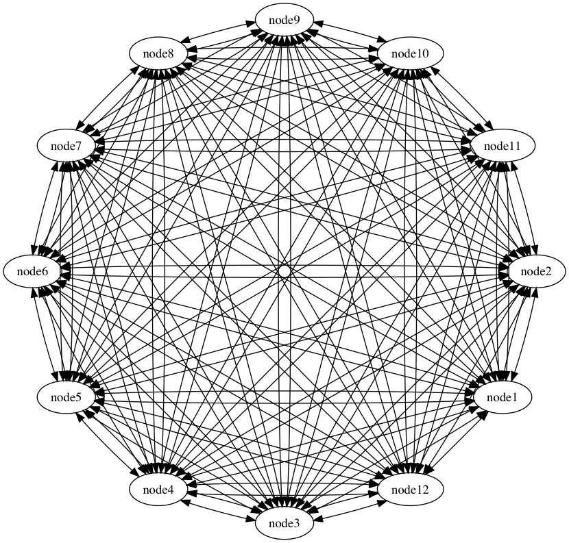

Bottos Network
--------
&nbsp;
&nbsp;
&nbsp;


# 1. Netwok structure

Bottos网络中的典型角色有三种：
- 终端用户
- 终端用户接入服务的提供者
- 超级节点（区块生产者）

&nbsp;

这三类角色将Bottos网络分成了三层，如下图所示。分别是
- 终端用户所在的接入层，这些终端用户有可能形成的终端网络
- 接入服务的提供者节点之间形成的服务层
- 超级节点之间组成的生产者网络

&nbsp;
&nbsp;


&nbsp;
&nbsp;
## 1.1. Super Node Network

超级节点承担全网所有Transaction的执行和记录，是全网络稳定的基础，因此铂链在超级节点网络设计采用了全连接方式组网。如下图所示（以10个超级节点的全连接为例。实际的超级节点个数为49个，其中每轮选中29个出块，另外20个节点备选）



&nbsp;
&nbsp;

## 1.2. Connections with Other Nodes

除超级节点外的其它类型节点，是组织松散的网络，类似下图中的mesh结构的连接方式


&nbsp;
&nbsp;

# 2. Node Layers

Bottos nodes are divided into: basic service nodes, application-oriented nodes, light nodes and ultra-light nodes. Each node checks and balances and complements each other, forming a dynamic balance of the self-consistent node system.

-  **Basic service nodes**

```
The Basic Service node provides the fundamental  service of the whole Bottos blockchain system, in addition to supporting the core functions of the blockchain core, such as transaction consensus, contract deployment, block production, etc., it also supports the main functions that provided by the Bottos service layer, such as unified identity system, storage management services, credit services, Token management and contract management and other key functions, to provide the most important production services for the overall Bottos network.
```

-  **Application nodes**
```
The kind of application node primarily serves different Dapps’ deployments in the ecosystem, and application node can be deployed on itself, or be deployed on the fundamental nodes. (Logical applications on each fundamental node can charge a certain deployment threshold fee in future.)
```

-  **Lightweight nodes**
```
The lightweight node chiefly works as the data verification node of Bottos, and it does not provide the corresponding function of the service layer. It only carries on the block data’s synchronization and so on, and can also support the Bottos core Layer basic service.
```


-  **Ultra lightweight nodes**
```
The ultra lightweight node chiefly handles the block correlation head verification, and synchronizes the key hash data, etc.
```