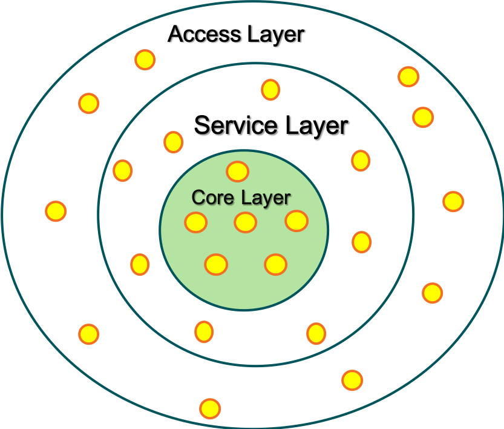
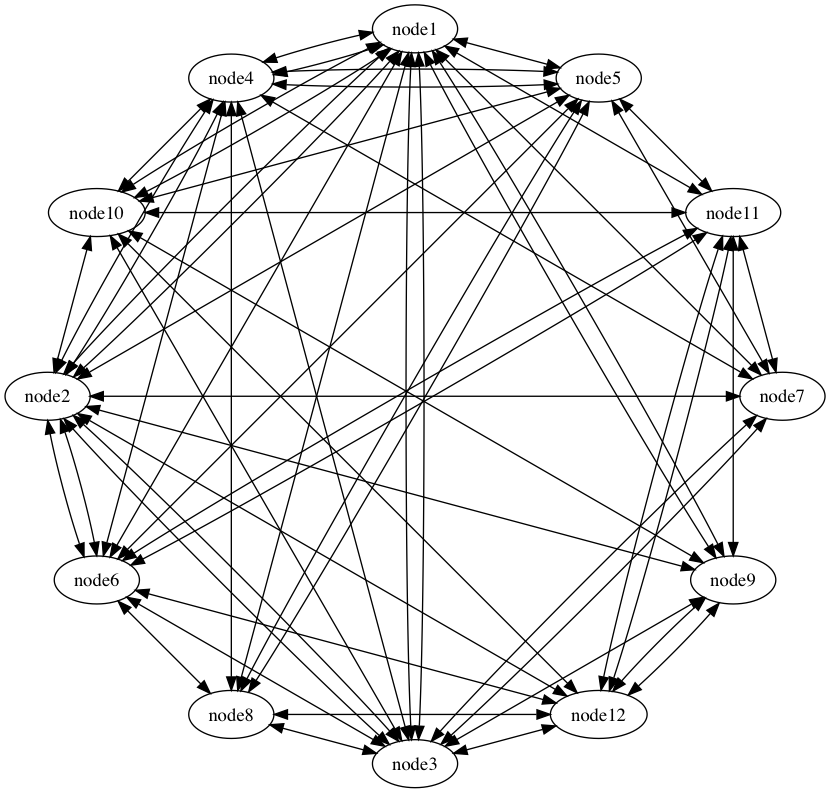

Bottos Network
--------
&nbsp;
&nbsp;
&nbsp;


# 1. Netwok structure

## 1.1 The overall of network

There are three typical roles in Bottos networks：
- The end user
- The provider of end-user access services
- The super node (block producer)

&nbsp;

These three roles divide the Bottos network into three layers, as shown in the figure below respectively:

- The access layer where the end users are located, and the terminal network that these end users may form

- A service layer formed between provider nodes which provide the accessing services

- A producer network that consisting of supernodes

&nbsp;
&nbsp;



&nbsp;
&nbsp;
## 1.2. Super Node Network

Supernodes undertake the execution and recording of all transactions in the whole network, which is the fundation for the stability of the whole network. Therefore, Bottos adopts the full-connection networking in the design of the supernode network, as shown in the figure below (take a full connection of 10 supernodes as an example. The actual number of super nodes is 49, among which 29 are selected for each round and the other 20 nodes are optional)


&nbsp;
&nbsp;

## 1.3. Connections with Other Nodes

除超级节点外的其它类型节点，是组织松散的网络，类似下图中的mesh结构的连接方式




&nbsp;
&nbsp;

# 2. Node Layers

Bottos nodes are divided into: basic service nodes, application-oriented nodes, light nodes and ultra-light nodes. Each node checks and balances and complements each other, forming a dynamic balance of the self-consistent node system.

-  **Basic service nodes**

```
The Basic Service node provides the fundamental  service of the whole Bottos blockchain system, in addition to supporting the core functions of the blockchain core, such as transaction consensus, contract deployment, block production, etc., it also supports the main functions that provided by the Bottos service layer, such as unified identity system, storage management services, credit services, Token management and contract management and other key functions, to provide the most important production services for the overall Bottos network.
```

-  **Application nodes**
```
The kind of application node primarily serves different Dapps’ deployments in the ecosystem, and application node can be deployed on itself, or be deployed on the fundamental nodes. (Logical applications on each fundamental node can charge a certain deployment threshold fee in future.)
```

-  **Lightweight nodes**
```
The lightweight node chiefly works as the data verification node of Bottos, and it does not provide the corresponding function of the service layer. It only carries on the block data’s synchronization and so on, and can also support the Bottos core Layer basic service.
```


-  **Ultra lightweight nodes**
```
The ultra lightweight node chiefly handles the block correlation head verification, and synchronizes the key hash data, etc.
```